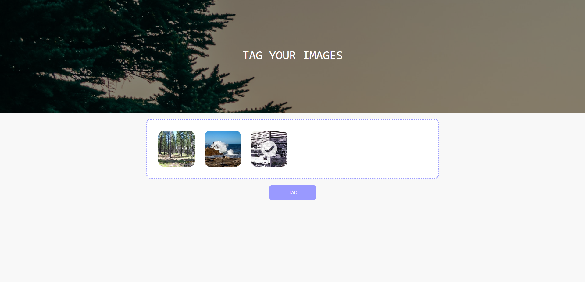

## Website for tagging images

For the main projects model I have created a website which lets you upload images via drag and drop and then have the model assign possibe tags to them.
Main purpose of this website was to practice how such a model would work in production.

